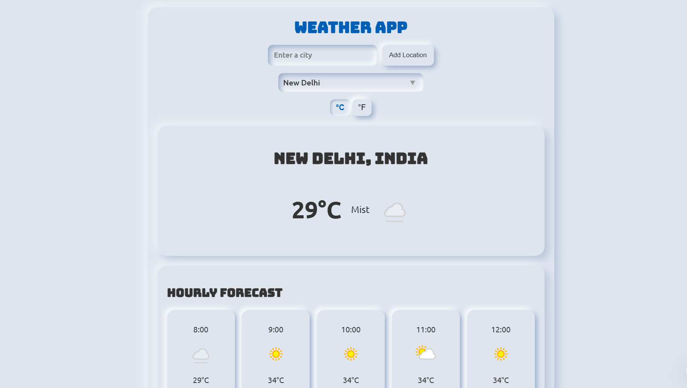

# 🚀 Vicky Narvare - Portfolio Website

A modern, responsive portfolio website showcasing my work as a Frontend Developer. Built with vanilla HTML, CSS, and JavaScript, featuring smooth animations using GSAP.

## ✨ Features

- **Modern Design**: Clean and professional UI with dark/light theme toggle
- **Fully Responsive**: Optimized for all devices (mobile, tablet, desktop)
- **Smooth Animations**: GSAP-powered animations and transitions
- **SEO Optimized**: Complete meta tags, Open Graph, Twitter Cards, and structured data
- **Performance**: Optimized loading and smooth scrolling (disabled on mobile for better UX)
- **Interactive Sections**:
  - Hero section with typing animation
  - About section with skills showcase
  - Services section with expandable cards
  - Portfolio projects showcase
  - Contact form with validation

## 🛠️ Technologies Used

- **HTML5**: Semantic markup
- **CSS3**: Modern styling with CSS variables, flexbox, and grid
- **JavaScript (ES6+)**: Interactive functionality
- **GSAP**: Smooth animations and scroll effects
- **Boxicons**: Icon library

## 📁 Project Structure

```
portfolio/
├── Index.html          # Main HTML file
├── main.css            # Stylesheet
├── script.js           # Main JavaScript file
├── animation.js        # GSAP animations
├── Images/             # Image assets
│   ├── vicky.jpg       # Profile picture
│   ├── project1.png    # Project screenshots
│   ├── project2.png
│   ├── project3.png
│   └── project4.png
└── PPFragment-SansLight.ttf  # Custom font
```

## 🚀 Getting Started

### Prerequisites

- A modern web browser (Chrome, Firefox, Safari, Edge)
- A code editor (VS Code recommended)
- Basic knowledge of HTML, CSS, and JavaScript

### Installation

1. **Clone the repository** or download the project files
   ```bash
   git clone <repository-url>
   cd new_portfolio
   ```

2. **Open the project**
   - Simply open `Index.html` in your web browser
   - Or use a local server for development:
     ```bash
     # Using Python
     python -m http.server 8000
     
     # Using Node.js (http-server)
     npx http-server
     
     # Using VS Code Live Server extension
     # Right-click Index.html > Open with Live Server
     ```

3. **Customize the content**
   - Edit `Index.html` to update your information
   - Modify `main.css` to change colors and styling
   - Update images in the `Images/` folder

## 🎨 Customization

### Changing Colors

Edit CSS variables in `main.css`:
```css
:root {
  --primary-color: #6366f1;
  --accent-color: #6366f1;
  --text-color: #333;
  /* ... other variables */
}
```

### Updating Projects

Edit the works section in `Index.html`:
```html
<div class="work-item">
  <div class="work-image">
    
  </div>
  <div class="work-content">
    <h3>Project Name</h3>
    <p>Project description</p>
    <!-- ... -->
  </div>
</div>
```

### Adding Your Information

1. **Personal Info**: Update meta tags and content in `Index.html`
2. **Social Links**: Update social media URLs in the contact section
3. **Projects**: Add/remove projects in the works section
4. **Skills**: Modify skill tags in the about section

## 📱 Browser Support

- Chrome (latest)
- Firefox (latest)
- Safari (latest)
- Edge (latest)
- Mobile browsers (iOS Safari, Chrome Mobile)

## 🚀 Deployment

### Deploy to Vercel

1. Push your code to GitHub
2. Go to [Vercel](https://vercel.com)
3. Import your GitHub repository
4. Deploy (automatic)

### Deploy to Netlify

1. Go to [Netlify](https://netlify.com)
2. Drag and drop your project folder
3. Deploy (automatic)

### Deploy to GitHub Pages

1. Push code to GitHub repository
2. Go to Settings > Pages
3. Select branch and folder
4. Save

### Manual Deployment

Upload all files to your web hosting via FTP/cPanel.

## 📋 Pre-Deployment Checklist

See [DEPLOYMENT_CHECKLIST.md](./DEPLOYMENT_CHECKLIST.md) for a complete checklist.

### Quick Checks:

- [ ] All images optimized
- [ ] Contact form integrated (Formspree/EmailJS)
- [ ] All URLs updated to production domain
- [ ] Tested on multiple browsers
- [ ] Tested on mobile devices
- [ ] Social media links verified
- [ ] SEO meta tags updated

## 🔧 Configuration

### Contact Form Setup

Currently, the contact form uses client-side validation. For production, integrate with:

**Option 1: Formspree**
```html
<form action="https://formspree.io/f/YOUR_FORM_ID" method="POST">
```

**Option 2: EmailJS**
- Sign up at [EmailJS](https://www.emailjs.com)
- Add script and configure

**Option 3: Netlify Forms** (if using Netlify)
- Add `netlify` attribute to form tag

### Analytics

Add Google Analytics:
```html
<!-- Add before closing </head> tag -->
<script async src="https://www.googletagmanager.com/gtag/js?id=GA_MEASUREMENT_ID"></script>
```

## 📝 License

This project is open source and available under the MIT License.

## 👤 Author

**Vicky Narvare**

- Email: vickynarvare51@gmail.com
- GitHub: [@VickyNarvare](https://github.com/VickyNarvare)
- LinkedIn: [vickynarvare](https://linkedin.com/in/vickynarvare)
- Portfolio: [vickynarvare.vercel.app](https://vickynarvare.vercel.app)

## 🙏 Acknowledgments

- GSAP for amazing animation library
- Boxicons for beautiful icons
- All the open-source community for inspiration

## 📞 Support

If you have any questions or suggestions, feel free to reach out!

---

**Made with ❤️ by Vicky Narvare**

