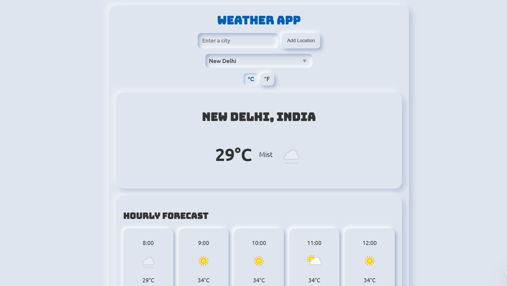

# 🚀 Vicky Narvare - Portfolio Website

A modern, responsive portfolio website showcasing my work as a Frontend Developer. Built with vanilla HTML, CSS, and JavaScript, featuring smooth animations using GSAP.
## Demo "https://vickynarvare.vercel.app"
## ✨ Features

- **Modern Design**: Clean and professional UI with dark/light theme toggle
- **Fully Responsive**: Optimized for all devices (mobile, tablet, desktop)
- **Smooth Animations**: GSAP-powered animations and transitions
- **SEO Optimized**: Complete meta tags, Open Graph, Twitter Cards, JSON-LD structured data, and sitemap
- **PWA Ready**: Progressive Web App support with offline capabilities and app installation
- **Performance**: Optimized loading with preload directives and smooth scrolling (disabled on mobile for better UX)
- **Enhanced Typography**: Custom fonts (LucyRose for headings, LatoRegular for body)
- **User Feedback**: Contact form with validation and error toast notifications
- **Interactive Sections**:
  - Hero section with typing animation
  - About section with skills showcase
  - Services section with expandable cards
  - Portfolio projects showcase
  - Contact form with validation and feedback

## 🛠️ Technologies Used

- **HTML5**: Semantic markup with comprehensive SEO meta tags
- **CSS3**: Modern styling with CSS variables, flexbox, grid, and custom fonts
- **JavaScript (ES6+)**: Interactive functionality with form validation
- **GSAP**: Smooth animations and scroll effects
- **Boxicons**: Icon library
- **Schema.org**: Structured data for search engines (JSON-LD)
- **PWA**: Service workers and manifest.json for offline support

## 📁 Project Structure

```
portfolio/
├── index.html               # Main HTML file with SEO meta tags
├── css/
│   └── main.css             # Stylesheet (optimized, unused CSS removed)
├── js/
│   ├── script.js            # Main JavaScript file
│   ├── animation.js         # GSAP animations
│   ├── projects.js          # Projects functionality
│   ├── services.js          # Services functionality
│   ├── skills.js            # Skills functionality
│   └── social-links.js      # Social links
├── fonts/
│   ├── Lato/               # LatoRegular font files
│   └── LucyRose/           # LucyRose font files
├── Images/                  # Image assets
│   ├── vicky.jpg            # Profile picture
│   ├── project1.png         # Project screenshots
│   ├── project2.png
│   ├── project3.png
│   └── project4.png
├── config/
│   ├── robots.txt           # SEO crawling directives
│   ├── sitemap.xml          # XML sitemap for search engines
│   └── vercel.json          # Vercel deployment configuration
├── manifest.json            # PWA manifest for app installation
└── README.md                # This file
```

## 🚀 Getting Started

### Prerequisites

- A modern web browser (Chrome, Firefox, Safari, Edge)
- A code editor (VS Code recommended)
- Basic knowledge of HTML, CSS, and JavaScript

### Installation

1. **Clone the repository** or download the project files
   ```bash
   git clone <repository-url>
   cd new_portfolio
   ```

2. **Open the project**
   - Simply open `Index.html` in your web browser
   - Or use a local server for development:
     ```bash
     # Using Python
     python -m http.server 8000
     
     # Using Node.js (http-server)
     npx http-server
     
     # Using VS Code Live Server extension
     # Right-click Index.html > Open with Live Server
     ```

3. **Customize the content**
   - Edit `Index.html` to update your information
   - Modify `main.css` to change colors and styling
   - Update images in the `Images/` folder

## 🎨 Customization

### Changing Colors

Edit CSS variables in `css/main.css`:
```css
:root {
  --primary-color: #4070f4;
  --accent-color: #4070f4;
  --text-color: #333;
  /* ... other variables */
}
```

### Changing Fonts

The portfolio uses custom fonts configured in `css/main.css`:
- **Headings**: LucyRose font (elegant, personal touch)
- **Body**: LatoRegular font (clean, readable)

To modify fonts, update the `@font-face` declarations at the top of `main.css`.

### Updating Projects

Edit the works section in `Index.html`:
```html
<div class="work-item">
  <div class="work-image">
    
  </div>
  <div class="work-content">
    <h3>Project Name</h3>
    <p>Project description</p>
    <!-- ... -->
  </div>
</div>
```

### Adding Your Information

1. **Personal Info**: Update meta tags and content in `Index.html`
2. **Social Links**: Update social media URLs in the contact section
3. **Projects**: Add/remove projects in the works section
4. **Skills**: Modify skill tags in the about section

## 📱 Browser Support

- Chrome (latest)
- Firefox (latest)
- Safari (latest)
- Edge (latest)
- Mobile browsers (iOS Safari, Chrome Mobile)
## 🔧 Configuration

### SEO Configuration

**Robots.txt** (`config/robots.txt`):
- Controls search engine crawling
- Specifies sitemap location
- Optimized crawl delays for major search engines

**Sitemap** (`config/sitemap.xml`):
- Lists all portfolio sections for search engines
- Helps search engines discover and index pages

**Meta Tags** (`index.html`):
- Open Graph tags for social media sharing
- Twitter Card tags for Twitter/X
- JSON-LD structured data for Google
- Mobile and PWA meta tags

### Contact Form Setup

Currently, the contact form shows an error message. To enable it, integrate with:

**Option 1: Formspree** (Recommended)
1. Go to [Formspree](https://formspree.io)
2. Create new form and get form ID
3. Update `js/script.js` line ~331 to submit to:
```javascript
fetch('https://formspree.io/f/YOUR_FORM_ID', {
  method: 'POST',
  body: new FormData(contactForm)
})
```

**Option 2: EmailJS**
- Sign up at [EmailJS](https://www.emailjs.com)
- Add EmailJS script to `index.html`
- Configure service ID, template ID, and public key

**Option 3: Netlify Forms** (if using Netlify)
- Add `netlify` attribute to contact form in `index.html`

### Analytics

Add Google Analytics:
```html
<!-- Add before closing </head> tag in index.html -->
<script async src="https://www.googletagmanager.com/gtag/js?id=GA_MEASUREMENT_ID"></script>
<script>
  window.dataLayer = window.dataLayer || [];
  function gtag(){dataLayer.push(arguments);}
  gtag('js', new Date());
  gtag('config', 'GA_MEASUREMENT_ID');
</script>
```

### PWA Setup

The portfolio includes a Progressive Web App manifest (`manifest.json`) for:
- App installation on mobile devices
- Offline support
- Custom theme colors and icons

To customize:
1. Edit `manifest.json` with your app details
2. Replace icons in `Images/` folder
3. Ensure `start_url` points to your deployment

## 🚀 Recent Updates (December 2025)

### Typography Enhancement
- Applied **LucyRose** font to all headings for elegant, personalized appearance
- Applied **LatoRegular** font to body text for improved readability
- Custom font-face declarations optimized for web loading

### Performance Optimization
- Removed ~484 lines of unused CSS (10% reduction)
- Eliminated orphaned classes and old responsive rules
- Added resource preloading for critical assets
- Optimized animations for mobile devices

### User Experience Improvements
- Added error toast notification for contact form
- Enhanced form validation feedback
- Improved mobile navigation interaction
- Smooth scroll animations on desktop

### SEO & Search Engine Optimization
- Added comprehensive meta tags (color-scheme, language, subject, security)
- Enhanced Open Graph tags for social media sharing
- Added Twitter Card meta tags
- Created PWA manifest for app installation
- Added JSON-LD structured data (Person, WebSite, ProfessionalService, Skills)
- Optimized robots.txt with crawl delays for major search engines
- XML sitemap with all portfolio sections

### Browser Compatibility
- Tested and optimized for all major browsers:
  - Chrome/Chromium (Desktop & Mobile)
  - Firefox (Desktop & Mobile)
  - Safari (macOS & iOS)
  - Edge (Desktop)
  - Samsung Internet
- CSS variables for consistent theming
- Fallback fonts for custom typography

## 📝 License

This project is open source and available under the MIT License.

## 👤 Author

**Vicky Narvare**

- Email: vickynarvare51@gmail.com
- GitHub: [@VickyNarvare](https://github.com/VickyNarvare)
- LinkedIn: [vickynarvare](https://linkedin.com/in/vickynarvare)
- Portfolio: [vickynarvare.vercel.app](https://vickynarvare.vercel.app)

## 🙏 Acknowledgments

- GSAP for amazing animation library
- Boxicons for beautiful icons
- All the open-source community for inspiration

## 📞 Support

If you have any questions or suggestions, feel free to reach out!

---

**Made with ❤️ by Vicky Narvare**

